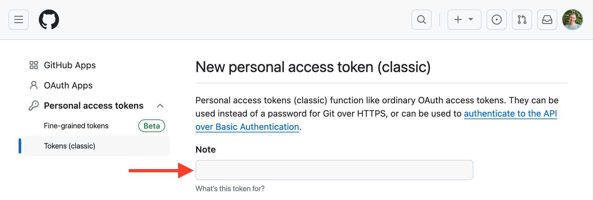

In this course, you'll learn how to use coroutines through the example of a program that loads the contributors for all of the repositories under a given GitHub organization.

So, you'll be utilizing the GitHub API in your project. To gain access, you'll need to provide your GitHub account name and either a password or a token. If you have two-factor authentication enabled, a token will be enough.

Generate a new GitHub token to access the GitHub API with [your account](https://github.com/settings/tokens/new):

1. Specify the name of your token, for example, `coroutines-tutorial`:

2. Do not select any scopes. **Click Generate** token at the bottom of the page.
3. Copy the generated token to a safe place. You won't be able to see it again in the future. If you lose it, you will need to create a new one.

For a more detailed description, you can refer to [this article](https://kotlinlang.org/docs/coroutines-and-channels.html#generate-a-github-developer-token).
